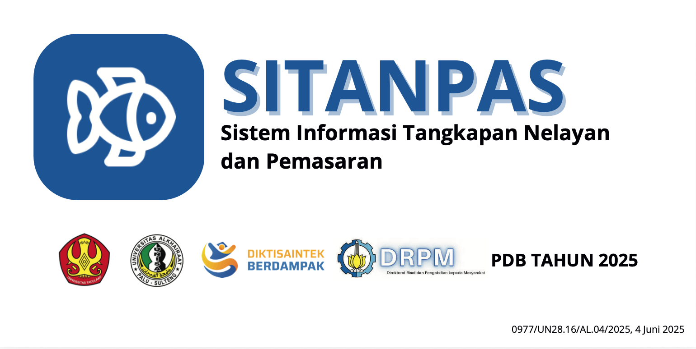

# 🐟 SITANPAS — Sistem Informasi Tangkapan Nelayan dan Pemasaran
**Status**: ✅ **PRODUCTION READY** | **Version**: 2.0 | **Last Updated**: Agustus 2026

<p align="center">
  
</p>

> **Proyek Tugas Akhir (TA) / Skripsi**  
> **Program Studi S1 Teknik Informatika — Universitas Tadulako**  
> **Pengembang:** Lukman Hakim  

---

## 📌 Tentang Proyek
**SITANPAS v2** (Sistem Informasi Tangkapan Nelayan dan Pemasaran) adalah platform *digital marketplace* berbasis web yang dirancang untuk memodernisasi ekosistem perdagangan hasil laut di Ambesia Selatan, Parigi Moutong, Sulawesi Tengah. Platform ini menghubungkan nelayan lokal secara langsung dengan pembeli publik, dilengkapi dengan sistem verifikasi penjual berbasis persetujuan admin, integrasi timbangan digital IoT (*Internet of Things*), serta otomatisasi stok dan transaksi *real-time*.

---

## ✨ Fitur Utama

### 🛒 1. Pembeli Publik (Guest Checkout)
* **Katalog Produk Interaktif:** Browsing hasil laut segar berdasarkan kategori, harga, dan ketersediaan stok.
* **Pemesanan Tanpa Login:** Checkout langsung (*Cash on Delivery*) tanpa diwajibkan mendaftar akun.
* **Manajemen Stok Otomatis:** Stok produk langsung berkurang saat pesanan dibuat dan otomatis kembali jika pesanan dibatalkan.

### ⚓ 2. Nelayan (Penjual)
* **Pendaftaran & Antrean Otorisasi:** Sistem registrasi akun nelayan dengan status awal *Pending Approval*.
* **Dashboard Nelayan:** Kelola produk ikan (tambah, edit, atur stok, hapus produk).
* **Integrasi Timbangan Digital (IoT):** Penarikan data berat timbangan ikan secara *real-time* via API ThingSpeak (ESP32).
* **Manajemen Pesanan Masuk:** Memantau dan memperbarui status pesanan dari pembeli.

### 🛡️ 3. Admin Marketplace
* **Sistem Persetujuan Akun:** Meninjau, menyetujui (*Approve*), atau menolak (*Reject*) pendaftaran nelayan baru.
* **Monitoring System & Analytics:** Laporan penjualan harian/bulanan, performa nelayan, serta ringkasan pendapatan sistem melalui *Database Views*.
* **Manajemen Pengguna & Produk:** Kontrol penuh terhadap seluruh akun terdaftar dan katalog produk aktif.

---

## 🛠️ Tech Stack & Ekosistem

* **Front-End:** React v18, TypeScript, Vite, Tailwind CSS, Shadcn UI / Radix UI
* **Back-End as a Service (BaaS):** Supabase (PostgreSQL 15, Auth JWT, Row Level Security)
* **Integrasi Hardware (IoT):** Mikrokontroler ESP32 + Sensor Load Cell via ThingSpeak API
* **Hosting & CD:** Netlify (Global Edge Network)

---

## 📁 Struktur Direktori Proyek

```text
SITANPAS/
├── md/                         # Dokumentasi Arsitektur Proyek (PRD, Architecture, Schema)
├── public/                     # Asset Statis (Logo, Favicon, _redirects)
├── src/                        # Source Code Utama Aplikasi
│   ├── assets/                 # Resource Gambar & Media
│   ├── components/             # Reusable UI Components (Dashboard, UI, IoT Fetcher)
│   ├── contexts/               # React Context (AuthContext)
│   ├── hooks/                  # Custom React Hooks
│   ├── integrations/supabase/  # Klien & Auto-generated Types Supabase
│   ├── pages/                  # Route Pages (Landing, Auth, Admin, Dashboard)
│   ├── utils/                  # Functions & Helper Utilities
│   ├── App.tsx                 # Root Router & Authorization Guard
│   └── main.tsx                # Entry Point React
├── supabase/migrations/        # Migration SQL Script (V2 Clean Architecture)
├── .env                        # Environment Variables lokal
├── netlify.toml                # Netlify SPA Redirects & Security Headers Config
└── package.json                # Project Dependencies & Manifest
```
